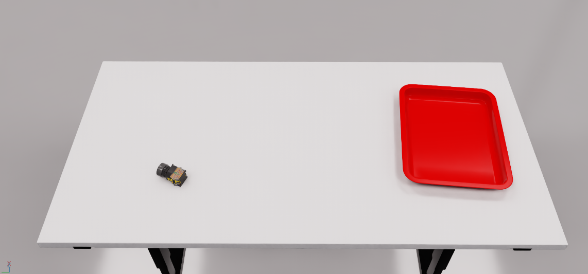
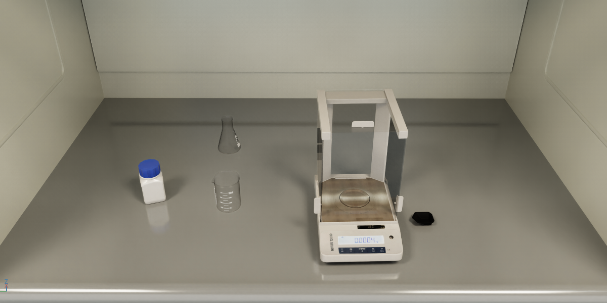
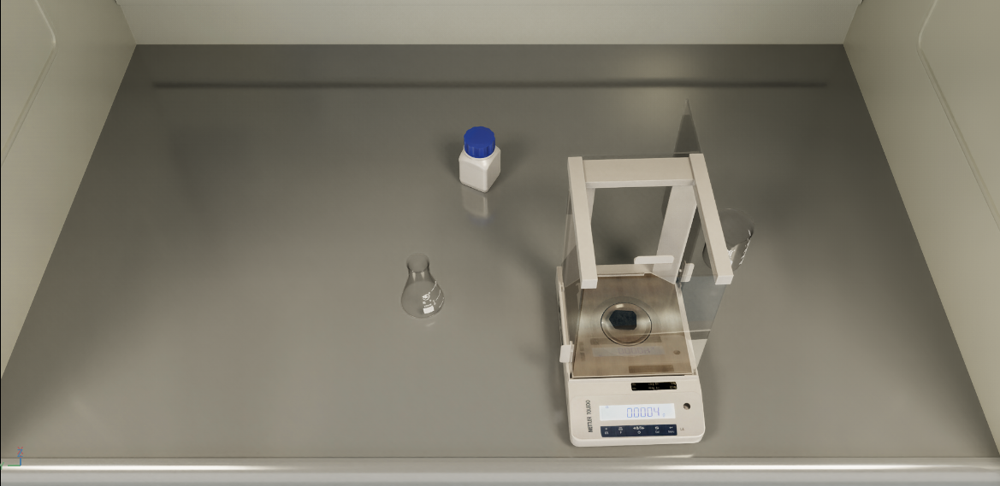

# ACT Training / Inference — Contestant Guide

This repository provides complete ACT (Action Chunking Transformer) training + inference code; the training data is open-sourced on ModelScope (see §2). You can train the ACT baseline directly, or replace the inference logic with your own algorithm — just follow the ZMQ contract in §5. Evaluation runs in the organizer's simulation and talks to your inference server over ZMQ.

## 1. Environment

Python 3.10 + one CUDA GPU (training/inference do **not** need Isaac Sim). Install (the combination verified by the organizer; you may use your own versions):

```bash
# torch must use --index-url (otherwise a CPU build is installed); match cuXXX to your CUDA: 12.x→cu128 / 13.x→cu130 / older→cu121
pip install torch==2.10.0 torchvision==0.25.0 --index-url https://download.pytorch.org/whl/cu130
pip install -r requirements.lock.txt
```

## 2. Data

The training data is open-sourced on **ModelScope**, ~200 episodes per task (one episode = one `.hdf5`), all used for training:

> https://modelscope.cn/datasets/X-Humanoid/VLA-Challenge-Dataset

**Download & place**: after downloading you get `<task>/h5_data/*.hdf5`; the training code reads `data/<task>/train/`, so put the hdf5 files there (**do not rename the task folders**; replace `<download>` with your download path):

```bash
for t in ind_task_01 ind_task_02 ind_task_03 lab_task_01 lab_task_03; do
  mkdir -p data/$t/train && cp <download>/$t/h5_data/*.hdf5 data/$t/train/
done
```

**Validation set (optional)**: move some files from `train/` to `val/` to enable periodic validation; if `val/` is empty or absent, all data is used for training.

```bash
cd data/ind_task_01 && mkdir -p val && ls train/*.hdf5 | shuf | head -20 | xargs -I{} mv {} val/
```

**Data fields** (each `.hdf5` = one episode, T frames):

```
camera_observations/color_images/camera_head   (T,) object   # JPEG; decoded to (720,1280,3) uint8 RGB
camera_observations/depth_images/camera_head   (T,) object   # PNG; decoded to (720,1280) uint16 mm (baseline unused)
puppet/arm_left_position_align/data            (T, 7)         # left arm joint angles
puppet/end_effector_left_position_align/data   (T, 6)         # left hand (fingers)
puppet/arm_right_position_align/data           (T, 7)         # right arm joint angles
puppet/end_effector_right_position_align/data  (T, 6)         # right hand (fingers)
```

Training state/action are both **26-dim**: `[left_arm 7, left_hand 6, right_arm 7, right_hand 6]` (baseline uses color + joints only).

## 3. Training

One command per task (run from the repo root; tmux background + auto-resume):

```bash
bash tools/train/run_train_act_5tasks.sh ind_task_01   # replace with one of the 5 task names
```

Defaults: 320×240 / batch 8 / chunk 50 / 100000 steps. Or call it directly:

```bash
python3 tools/train/train_act.py --task-dir data/ind_task_01 --ckpt-dir checkpoints/ind_task_01_act \
    --img-w 320 --img-h 240 --num-steps 100000 --batch-size 8 --chunk-size 50 --use-aug
```

Outputs in `checkpoints/<task>_act/`: `policy_last.ckpt` (used by inference by default) + `dataset_stats.pkl` (**must sit next to the ckpt**, auto-loaded) + `train.log`; `agent_best.ckpt` is produced only if you set aside a non-empty `val/`.

## 4. Inference server

```bash
python3 tools/policy_infer.py --policy act \
    --model-path checkpoints/ind_task_01_act/policy_last.ckpt \
    --zmq-recv-port 5556 --zmq-send-port 5557
    --task ind_task_01
```

When ready it prints `[runner] Ready — recv:127.0.0.1:5556  send:*:5557`. By default it talks to a simulation on the same host (`127.0.0.1`); to point at a remote organizer simulation, add `--sim-host <organizer-ip>` (your action port is published on all interfaces). Training and inference resolution must match (default 320×240); the task is resolved automatically from `dataset_stats.pkl`, so no task name is needed. The `--task` argument specifies the task name and instructs the remote organizer simulation which task to run for evaluation; task names are listed in [Section 6](#6-the-5-tasks).

## 5. ZMQ contract (read this for custom algorithms)

The simulation side (organizer) sends `obs` and receives `action`. If you use your own algorithm, just make your inference server follow the formats below.

**Obs (simulation → you, port 5556)**:

```python
obs = {
    "puppet": {
        "arm_left_position_raw":  {"data": np.ndarray(7,)},
        "arm_right_position_raw": {"data": np.ndarray(7,)},
        "end_effector_left_position_raw":  {"data": np.ndarray(6,)},
        "end_effector_right_position_raw": {"data": np.ndarray(6,)},
        "end_effector_left_pose_raw":  {"data": np.ndarray(7,)},   # left end-effector cartesian pose xyz+quat; optional, ACT ignores it
        "end_effector_right_pose_raw": {"data": np.ndarray(7,)},   # right end-effector cartesian pose; optional
    },
    "camera_observations": {
        "color_images": {
            "camera_head": np.ndarray(H, W, 3)   # RGB, uint8, native 1280x720
        },
        "depth_images": {
            "camera_head": np.ndarray(H, W)      # float32, unit mm (depth). Read it for an RGBD model; ignore if RGB-only
        }
    }
}
```

**Action (you → simulation, port 5557)**:

```python
action = {
    "left_arm":   list[float] * 7,   # left arm target joint angles
    "left_hand":  list[float] * 6,   # left hand target positions
    "right_arm":  list[float] * 7,   # right arm target joint angles
    "right_hand": list[float] * 6,   # right hand target positions
}
```

### Using your own algorithm (two options)

**Option A — reuse this repo's ZMQ loop (recommended, least effort)**: write one policy class, no ZMQ/eval to touch.

1. Create `tools/policies/my_policy.py`, subclass `BasePolicy` (`tools/policies/base_policy.py`), and implement 3 methods:

```python
import numpy as np
from tools.policies.base_policy import BasePolicy

class MyPolicy(BasePolicy):
    def _load_model(self):
        # load and return your model (self.model_path = the --model-path value, self.device = --device)
        return load_my_model(self.model_path)

    def reset(self):
        # clear internal state at the start of each episode (action buffer / history, etc.)
        ...

    def infer(self, obs: dict) -> np.ndarray:
        # obs structure is shown above; return a 26-dim action np.ndarray
        l_arm = np.array(obs["puppet"]["arm_left_position_raw"]["data"])     # (7,)
        r_arm = np.array(obs["puppet"]["arm_right_position_raw"]["data"])    # (7,)
        img   = obs["camera_observations"]["color_images"]["camera_head"]   # (H,W,3) RGB uint8
        action = ...                       # your inference logic
        return action.astype(np.float32)   # shape (26,) = [left_arm 7, left_hand 6, right_arm 7, right_hand 6]
```

> `BasePolicy.__init__(model_path, device)` automatically calls your `_load_model()` and stores it in `self.model`.

2. Add one line to `POLICY_MAP` in `tools/policies/__init__.py`: `"my_policy": None,`
3. In `tools/policies/runner.py`, at the policy-dispatch section, add an `elif` **before the `else:` fallback** (putting it after `else` raises `SyntaxError`):

```python
elif args.policy == "my_policy":
    from tools.policies.my_policy import MyPolicy as _PolicyCls
```

Launch: `python3 tools/policy_infer.py --policy my_policy --model-path <your model>`.
The runner automatically splits the 26-dim vector returned by your `infer` into 4 action fields via `[:7]/[7:13]/[13:20]/[20:26]` — you **never touch ZMQ**.

**Option B — write your own inference server**: independent of this repo's code; just follow this section's ZMQ contract — receive `obs` on port 5556, send `action` on 5557, handle the handshake (the simulation first sends `test` to warm up → `start` → the `obs`/`action` loop → `reset`), send actions back as `{left_arm[7], left_hand[6], right_arm[7], right_hand[6]}`, with a monotonically increasing `step_id`.

**Task name handshake**: Before the main inference loop begins, your server should publish the task name (passed via `--task` argument) and wait for the simulator's acknowledgment (`task_cbd` topic). This ensures both sides are synchronized on which task to run. For a complete implementation, see [tools/policies/runner.py](tools/policies/runner.py):

```python
# Publish task name to sim side, wait for task_cbd ack
print(f"[runner] Publishing task {args.task!r}, waiting for task_cbd...")
while True:
    zmq_publisher.send_msg(args.task, topic=b"task")
    result = zmq_receiver.receive_envelope(timeout=500)
    if result is not None and str(result.get("topic", "")) == "task_cbd":
        print("[runner] task_cbd received, starting inference loop")
        break
```

This handshake guarantees that the simulator has initialized the correct task before you begin receiving observations.

## 6. The 5 tasks

> Each task provides 50 scenarios; evaluation picks them by a random seed (reproducible, identical for all contestants).

| Task | Task description | Example scenario |
|---|---|---|
| `ind_task_01` | Use the left hand to place the gear into the red tray. |  |
| `ind_task_02` | Use both hands to place two industrial switches / red buttons into the pink storage basket. |  |
| `ind_task_03` | Pick up the switch with the left hand, transfer it to the right hand, and place it into the red tray. |  |
| `lab_task_01` | Use the right arm to open the door of the electronic balance. |  |
| `lab_task_03` | Use the right arm to close the door of the electronic balance. |  |

## 7. Local simulation visualization (optional): watch your policy run

You can run your policy inside the same simulation used by the challenge — locally, on your own machine — and watch it act in the 5 tasks, either live in a GUI window or as per-episode mp4 videos. This is visualization only: there is no scoring output; episodes run for a fixed duration (`--timeout`, default 300 s) and then move on. The official evaluation is run by the organizer.

**Requirements**: [Isaac Sim](https://developer.nvidia.com/isaac/sim) 5.1 (RTX GPU required). The GUI window needs a machine with a display; on a headless server use `--headless` and watch the videos instead.

**One-time setup**:

```bash
# 1) Point the config to your Isaac Sim install (edit the file):
#    common/isaac_config.toml  ->  python_path = "/path/to/your/isaacsim/python.sh"
# 2) Install simulation deps INTO Isaac's bundled python (not your training env):
/path/to/your/isaacsim/python.sh -m pip install -r requirements.sim.txt
```

**Run** (from the repo root; needs a trained checkpoint from §3):

```bash
bash tools/run_sim_local.sh --task ind_task_01 --ckpt checkpoints/ind_task_01_act/policy_last.ckpt
# headless server: add --headless, then watch logs/task_videos/*.mp4
# options: --loop 3 (episodes) --seed 0 (scene sampling) --timeout 300 (seconds per episode) --no-video (skip mp4 recording)
```

The script starts the simulator and your inference server; they handshake on the task name (§5), then episodes run with scenes sampled from the task's 50 scenarios. A video of every episode is saved to `logs/task_videos/`.

**Under the hood** (the two processes the script manages, for debugging):

```bash
# terminal 1 — simulator (waits for the task name over ZMQ, GUI unless --headless):
/path/to/isaacsim/python.sh benchmark.py --loop 3 --seed 0
# terminal 2 — your inference server (announces the task, then serves actions):
python3 tools/policy_infer.py --policy act --model-path <ckpt> --task ind_task_01
```

**FAQ**

- *Port 5556/5557 already in use*: a previous run left processes behind — `pkill -f benchmark.py; pkill -f policy_infer.py` and retry.
- *Stuck at "waiting for task_cbd"*: rare startup race — Ctrl-C and rerun the script.
- *No GUI window appears*: check the machine has a display (`echo $DISPLAY`); otherwise use `--headless` + videos.
- *First episode is slow*: Isaac Sim takes 1–3 minutes to load; later episodes are faster.
- *Robot model file*: shipped compressed (`usds/tianyi_2_6d_force_brainco2_hand_v1/*.usd.gz`, due to GitHub's 100 MB file limit); the script auto-extracts it on first run. For manual two-terminal use, run `gunzip -k usds/tianyi_2_6d_force_brainco2_hand_v1/*.usd.gz` once first.
- *The robot keeps standing after finishing the task*: expected — locally each episode runs the full `--timeout` and then resets.
